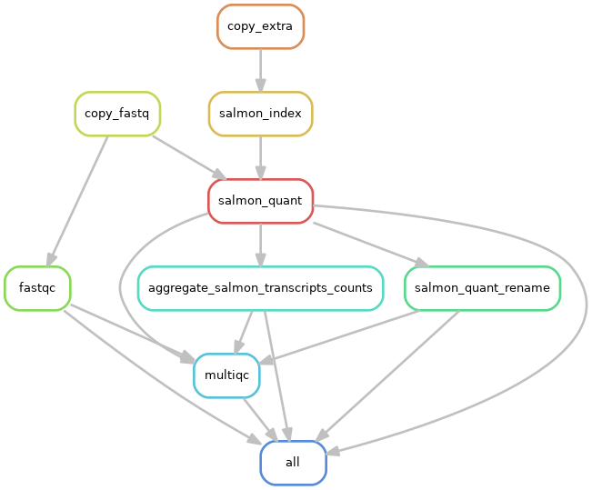

# Snakemake workflow: rna-count-salmon

This is the [Snakemake](https://academic.oup.com/bioinformatics/article/28/19/2520/290322) workflow for RNA-Seq read count, powered by [Salmon](https://salmon.readthedocs.io/en/latest/). Optional quality controls are performed by [FastQC](https://www.bioinformatics.babraham.ac.uk/projects/fastqc/) and aggregated by [MultiQC](https://academic.oup.com/bioinformatics/article/32/19/3047/2196507)

Each tool belong to their respective authors.

See [wiki](https://github.com/tdayris-perso/rna-count-salmon/wiki) for more information.

## Rule graph:

